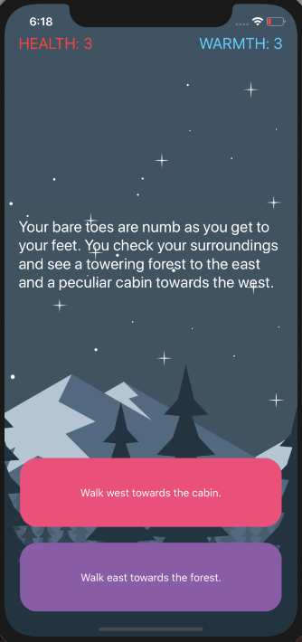

#  Fateful Survival
 

## About the application

This app is a simple, yet elegenat, “choose your own adventure” game similar to the App Store hit “Life Line”. The app will tell a story depending on what the user chooses and can be fleshed out and modified to provide an engaging story-telling experience.

## Screenshots

### Make your decision:

## What I learned

* How to use the Model-View-Controller or MVC pattern for app development.
* Understand the difference between value types and reference types.
* How to look out and cover failure cases.
* How to refactor code and stay organized.

